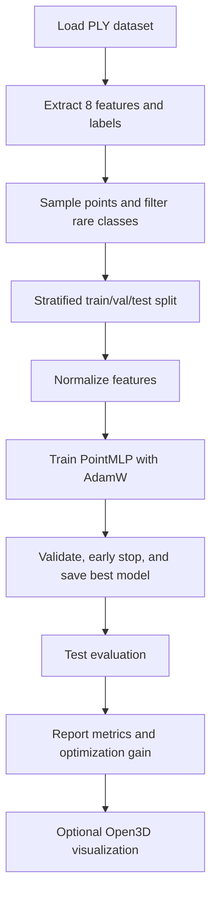

# Data Point Cloud Optimization

Point-cloud classification pipeline using PyTorch and PLY input data.

This project trains a neural network on point attributes from a `.ply` file, evaluates performance, reports optimization gains over a baseline, and visualizes predicted segmentation in Open3D.

## 1. Project Goal

- Train a classifier for point-cloud semantic classes.
- Improve test accuracy through better feature usage and training strategy.
- Show final point-cloud prediction visually.
- Report how much optimization was achieved compared to a baseline accuracy.

## 2. Project Structure

- `main.py`: Full training, evaluation, optimization summary, and visualization pipeline.
- `data/`: Input `.ply` dataset files.
- `output.txt`: Optional captured output/log file.

## 3. Data and Features

Input file default:

- `data/Lille1.ply`

Target column:

- `class`

Features used for training:

- `x`, `y`, `z`, `x_origin`, `y_origin`, `z_origin`, `GPS_time`, `reflectance`

Notes:

- Labels are remapped to contiguous class IDs `[0..num_classes-1]`.
- Very rare classes (fewer than 3 sampled points) are removed to keep stratified splitting stable.

## 4. Training Flow

1. Load `.ply` point cloud.
2. Sample up to `--max-points` points.
3. Build feature matrix and labels.
4. Remove ultra-rare classes for robust split.
5. Split data into train/validation/test with stratification.
6. Normalize features using train-set mean/std.
7. Train an MLP classifier with:
   - BatchNorm
   - Dropout
   - AdamW optimizer
   - ReduceLROnPlateau scheduler
   - Early stopping by validation performance
8. Evaluate on test set.
9. Print metrics:
   - Test loss and test accuracy
   - Classification report
   - Confusion matrix
10. Render predicted segmentation in Open3D (enabled by default).
11. Print optimization summary against baseline accuracy.

## 4.1 Visual Flow Diagram



## 5. Environment Setup

From project root:

```powershell
python -m venv .venv
.\.venv\Scripts\Activate.ps1
pip install numpy torch plyfile scikit-learn open3d
```

## 6. Run Commands

From the project root, after activating the virtual environment:

```powershell
python main.py --epochs 35 --patience 8
```

Train and evaluate without the visualization window:

```powershell
python main.py --epochs 35 --patience 8 --no-visualize
```

Use class-weighted loss when you want to compare balanced vs unbalanced training:

```powershell
python main.py --epochs 35 --patience 8 --balanced-loss
```

Set custom baseline for optimization summary:

```powershell
python main.py --baseline-accuracy 0.2989
```

If you are running on a remote or headless machine, keep `--no-visualize` enabled so the script stays practical without an Open3D window.

## 7. Local vs HPC Comparison

To show the difference between the 8-core local run and the 48-core HPC run in git, keep the comparison in this README or in a separate results markdown file and commit it alongside the code change.

Suggested comparison fields:

| Environment | CPU cores | Training data | Epochs | Test accuracy | Test loss | Notes |
| --- | ---: | --- | ---: | ---: | ---: | --- |
| Local machine | 8 | same split / subset | 35 | ~0.85 | n/a | local 8-core run |
| HPC server | 48 | full training set | 35 | 0.8889 | n/a | metrics from the provided HPC screenshot |

If you want the difference to be visible in git history, the cleanest approach is to keep these measured values here and commit the README update. That way `git diff` shows the exact metric changes, and future readers can compare the environments directly.

Optimization summary outputs:

```text
Local machine (8 cores)
Baseline Accuracy : 0.2989
Current Accuracy  : ~0.85
Absolute Gain     : +0.5511 (+55.11 percentage points)
Relative Gain     : +184.36%

HPC server (48 cores)
Baseline Accuracy : 0.2989
Current Accuracy  : 0.8889
Absolute Gain     : +0.5899 (+58.99 percentage points)
Relative Gain     : +197.37%
```

## 8. Optimization Summary Output

At the end of each run, the script prints:

- Baseline Accuracy
- Current Accuracy
- Absolute Gain
- Relative Gain (%)

Example interpretation:

Use the table above for the actual 8-core local and 48-core HPC comparison values.

## 9. Suggested Git Workflow

```powershell
git add main.py README.md
git commit -m "Add optimization summary and complete project README"
git push origin <your-branch>
```

## 10. Troubleshooting

- If Open3D import warning appears in editor but runtime works, reload VS Code/Python interpreter.
- If stratified split errors appear, increase `--max-points` or keep rare-class filtering enabled.
- If training is slow on CPU, reduce `--max-points` or `--epochs`, or run on GPU.
